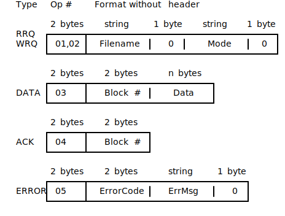

## Frame Layout

Packet does not come in such beautiful structure, Data comes in binary format. Here is the binary format of each frame:



First 2 bytes of each packet is `opcode`, It describes the type of the packet.

We will use a library called [bin-layout](https://github.com/nurmohammed840/bin-layout.rs) to decode the binary data.

```toml
[dependencies]
bin-layout = "5"
```
