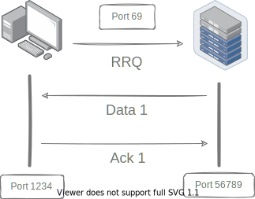
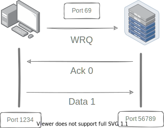

## Details

No more talk! 🤫  I assume you have some basic programing knowledge, We will use Rust 🚀, 
But no rust specific knowledge required.

<div id="frame"></div>

```admonish info ""
[Enums](https://doc.rust-lang.org/book/ch06-01-defining-an-enum.html) in rust are [algebraic data type](https://en.wikipedia.org/wiki/Algebraic_data_type), You can think of it as [discriminated unions](https://en.wikipedia.org/wiki/Tagged_union). 
```

We can then perform [pattern matching](https://doc.rust-lang.org/rust-by-example/custom_types/enum.html) on enum, Ignore `&'a` for now. ⌚

### Request

The client first requests the server to read or write some data. At [wellknown port](https://en.wikipedia.org/wiki/List_of_TCP_and_UDP_port_numbers) `69`.

 `Request` containing the filename, transfer mode and optionally any negotiated option. (We willn't discuss those options in this tutorial)


### Data Transfer

Based on request, The server or client sends data to the other endpoint.

The data is sent in fixed length blocks of `512` bytes by default or the number specified in the blocksize negotiated option.

The last data block must be less than the negotiated or default blocksize (which is `512`) to signals the end of the transfer.

```admonish quote ""
_What heppens when the last block is exact block sized data?_
```

If that happens, endpoint sends `0` sized packet to signal the end of the transfer.

Initially, `block` number is `1`. On each transfer, the block number is incremented by one.

```admonish quote ""
_What happens when the block number is exhausted?_
```

Wikipedia says, The original protocol has a transfer file size limit of `512 * 65535` blocks = `32` MB, Today most servers and clients support block number roll-over (block counter going back to 0 or 1 after 65535) which gives an essentially unlimited transfer file size.


```admonish note ""
If the response is positive, the server create a new socket and all transfers are performed using this new socket.
```

This approach significantly simplifies the implementation of overall protocol. As we don't need to track each user's socket.

### Acknowledgement

For [various reasons](https://en.wikipedia.org/wiki/Packet_loss#Causes), there might be some [packet lost](https://en.wikipedia.org/wiki/Packet_loss). The sender detect packet loss using a timer and retransmit missing packets. 

Acknowledgement indicate that the data has been received.

An Endpoint must send an acknowledgement packet for each data packet received.
Acknowledgement number must be the same as the block number of the data packet.

<style>
    .column { float: left; width: 33.33%; padding: 5px; box-sizing: border-box;  }
    .row::after { content: ""; clear: both; display: table; }
    @media screen and (max-width: 500px) { .column { width: 100%; }
</style>
<div class="row">
  <div class="column">
    
  </div>
  <div class="column">
    
  </div>
</div>

[Lock step](https://en.wikipedia.org/wiki/Lockstep_(computing)) system guarantees that all older packets have been received.

```admonish note ""
Positive response to a write request is an acknowledgment packet, in this special case the block number will be zero.
```

### Error

Any errors cause termination of the connection. This packet is not acknowledged, and not retransmitted. An Error packet contain an error code and text message.

<div id="err_code"></div>

<link rel="stylesheet" href="./assets/code.css">
<script type="module" src="./code/details.js"></script>