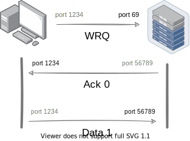

### Request

The client first requests the server to read or write some data. At [well known port](https://en.wikipedia.org/wiki/List_of_TCP_and_UDP_port_numbers) `69`.

`Request` frame containing the filename, transfer mode and optionally any negotiated option. (We will not discuss those options in this tutorial)

```rust
pub struct Resource {
    pub filename: Text,
    pub mode: Text,
}
```

```admonish note ""
`Text` is nul-terminated modified version of ascii string.
```

### Data Transfer

Based on request, The server or client sends the data frame to the other endpoint. Data frame contains a `block` number and payload. 

The payload is sent in a fixed length buffer of `512` bytes by default or the number specified in the block size negotiated option.

The last data block must be less than the negotiated or default blocksize (which is `512`) to signal the end of the transfer.

```admonish quote ""
_What happens when the last block is exact block sized ?_
```

If that happens, the endpoint sends a data frame of `0` byte to signal the end of the transfer.

Initially, `block` number is `1`. On each transfer, the block number is incremented by one.

```admonish quote ""
_What happens when the block number is exhausted ?_
```

According to wikipedia, The original protocol has a transfer file size limit of `512 * 65535` blocks = `32` MB, Today most servers and clients support block number roll-over (block counter going back to 0 or 1 after 65535) which gives an essentially unlimited transfer file size.


```admonish note ""
If the response is positive, the server create a new socket and all transfers are performed using this new socket.
```

This significantly simplifies the implementation of overall protocol. As we don't need to track each socket.

### Acknowledgement

For [various reasons](https://en.wikipedia.org/wiki/Packet_loss#Causes), there might be some [packet lost](https://en.wikipedia.org/wiki/Packet_loss). The sender detect packet loss using a timer and retransmit missing packets. This is known as [acknowledgement](https://en.wikipedia.org/wiki/Acknowledgement_(data_networks)).

Acknowledgement indicate that the data has been received.

An Endpoint must send an acknowledgement packet for each data packet received.
Acknowledgement number must be the same as the block number of the data packet.

<style>
    .column { float: left; width: 33.33%; padding: 5px; box-sizing: border-box;  }
    .row::after { content: ""; clear: both; display: table; }
    @media screen and (max-width: 500px) { .column { width: 100%; }
</style>
<div class="row">
  <div class="column">
    
  </div>
  <div class="column">
    
  </div>
</div>

It guarantees that all old packets are received and prevents [network congestion](https://en.wikipedia.org/wiki/Network_congestion).

```admonish note ""
Positive response to a write request is an acknowledgment packet, in this special case the block number will be zero.
```

### Error

Any errors cause termination of the connection. This packet is not acknowledged, and not retransmitted.

```rust
#[repr(u16)]
pub enum ErrorCode {
    NotDefined,
    FileNotFound,
    AccessViolation,
    DiskFull,
    IllegalOperation,
    UnknownTransferID,
    FileAlreadyExists,
    NoSuchUser,
}
```

An error frame contains an error code and reason.

```rust
pub struct Error {
    pub code: ErrorCode,
    pub reason: Text,
}
```

## Frame

In networking, a [frame](https://en.wikipedia.org/wiki/Frame_(networking)) is a fundamental unit of data transmission between two endpoint.

```rust
#[repr(u16)]
pub enum Frame {
    Read(Resource) = 1,
    Write(Resource) = 2,
    Data { block: u16, bytes: Bytes } = 3,
    Acknowledge(u16) = 4,
    Error(Error) = 5,
}
```

Here is the binary format of each [packet](https://en.wikipedia.org/wiki/Network_packet):


The first 2 bytes of each packet type are known as the `opcode` or [discriminant](https://en.wikipedia.org/wiki/Discriminator), It is just a number that identifies the type of the frame.

| Opcode | Frame Type     |
| :----: | :------------: |
|   1    | Read Request   |
|   2    | Write Request  |
|   3    | Data           |
|   4    | Acknowledgment |
|   5    | Error          |